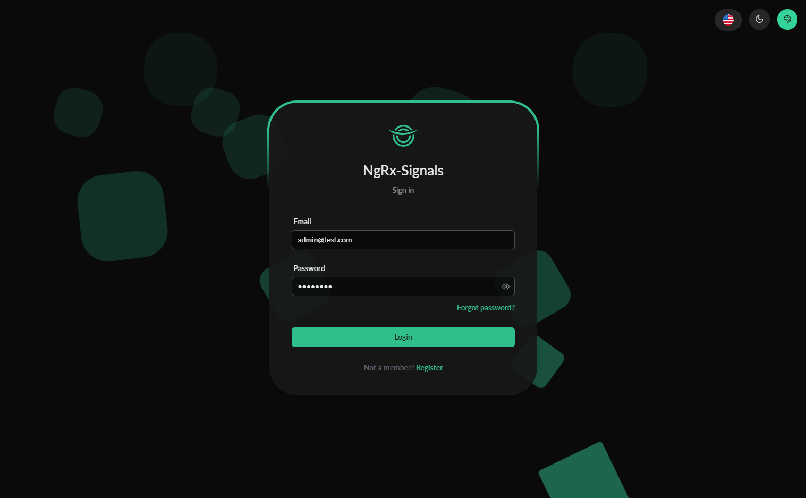

# Angular NgRx Signals

This project serves as a foundational template that demonstrates the interaction between NgRx stores and services. It provides a structured approach to managing state in your Angular applications using NgRx.



This project was generated using [Angular CLI](https://github.com/angular/angular-cli) version 19.1.2.

## Install dependencies

```bash
npm i
```

## Development server

To start a local development server, run:

```bash
npm start
```

Once the server is running, open your browser and navigate to `http://localhost:4200/`

## Docker deploy

Adjust Dockerfile and docker-compose files if you need, run:

```bash
docker compose up -d
```
